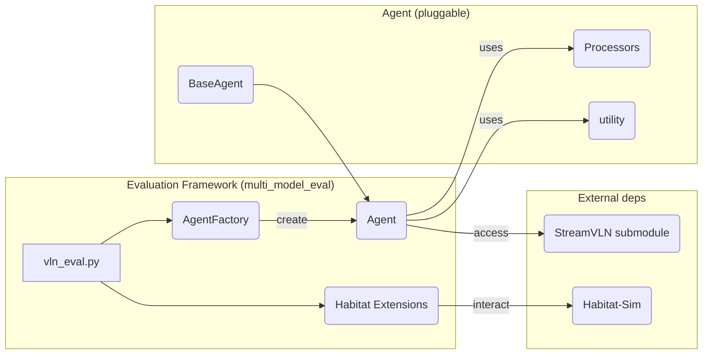
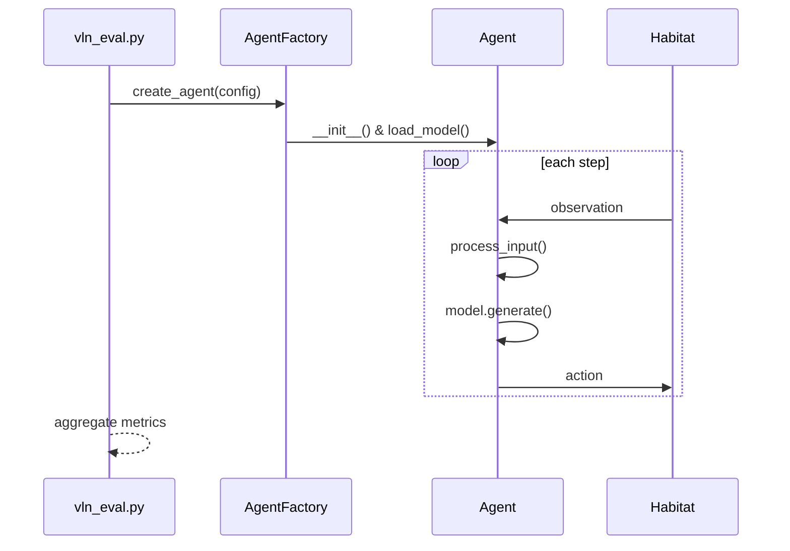
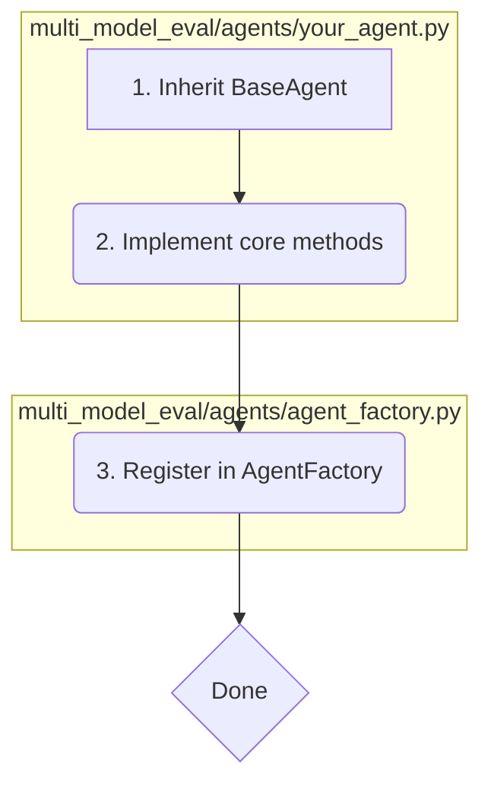

# 🎯 VLN Platform: Pluggable Multi-Model Evaluation Framework

A Vision-and-Language Navigation (VLN) evaluation platform designed with a “pluggable Agent” architecture so you can integrate new models with minimal effort.

---
## Project Structure

- `multi_model_eval/`: Core evaluation framework of this project.
  - `agents/`: Agent-related code.
    - `base_agent.py`: Abstract base class with core methods like `load_model_and_processor`, `act`.
    - `agent_factory.py`: Agent factory for unified creation and parameter dispatch; register new agents here.
    - `streamvln_agent.py`: Example Agent integrated with StreamVLN.
    - `processors/`: Pre-/post-processing modules, extend as needed.
  - `utility/`: General utilities (device detection, distributed utils), renamed to avoid conflicts with submodule `utils`.
  - `habitat_extensions/`: Adapters for Habitat environment integration.
  - `vln_eval.py`: Entry point for evaluation (parse args, init, evaluation loop, metrics aggregation).
- `config/`: Evaluation configs (e.g., R2R/RxR dataset configs).
- `checkpoints/`: Local models and resources (e.g., Vision Tower with `config.json`).
- `scripts/`: Utility scripts (e.g., multi-GPU evaluation, downloads).
- `data/`: Dataset root (mounted inside container when using Docker).
- `.docker/`: Docker compose and service definitions to reproduce environments.

- `StreamVLN/`: Official StreamVLN repository as a submodule. Prefer not to modify directly so upstream sync remains easy.

👉 Tips for changes:
- When adding/adapting a model, prefer creating a new Agent under `multi_model_eval/agents/`.
- Add pre-/post-processing in `processors/` and use them in your Agent.
- Place new evaluation configs under `config/` and pass via `--config_path`.

## 🚀 Quick Start

### Local workflow

One-time setup (first run only):
1. Clone the repo (with submodules):
   ```bash
   git clone --recursive <your_repo_url>
   ```
2. Install external dependencies (example: StreamVLN):
   ```bash
   pip install -r StreamVLN/requirements.txt
   ```
3. Prepare data and models:
   - Put datasets under `data/`
   - Put the vision tower and other models under `checkpoints/` (make sure `config.json` etc. exist)

Daily evaluation (repeatable):

1. Run evaluation
   - Multi-GPU script:
     ```bash
     bash scripts/vln_eval_multi_gpu.sh
     ```
   - Or single-run command:
     ```bash
     python multi_model_eval/vln_eval.py \
       --model_path <your_model> \
       --agent_type streamvln \
       --output_path results/ \
       --vision_tower_path checkpoints/google/siglip-so400m-patch14-384 \
       --config_path config/vln_r2r.yaml \
       --eval_split val_unseen \
       --num_future_steps 4 \
       --num_frames 16 \
       --num_history 8 \
       --model_max_length 2048 \
       --save_video
     ```
2. Inspect console output and results directory (e.g., `results/` if specified by your script/config).

### Docker workflow

Prerequisites:
- Docker Compose files are under `.docker/`
- Specify local data path (for container bind mount):
  ```bash
  export DATA_PATH=/path/to/data
  ```

Steps:
1. Build image (example for StreamVLN evaluation):
   ```bash
   docker compose -f .docker/docker-compose.yml -f .docker/docker-compose.streamvln.yml build
   ```
2. Start container (detached):
   ```bash
   docker compose -f .docker/docker-compose.yml -f .docker/docker-compose.streamvln.yml up -d
   ```
3. Enter the container shell:
   ```bash
   docker exec -it streamvln bash
   ```
4. Run evaluation inside the container:
   - Multi-GPU script:
     ```bash
     bash scripts/vln_eval_multi_gpu.sh
     ```
   - Or single-run command:
     ```bash
     python multi_model_eval/vln_eval.py \
       --model_path <your_model> \
       --agent_type streamvln \
       --output_path results/ \
       --vision_tower_path checkpoints/google/siglip-so400m-patch14-384 \
       --config_path config/vln_r2r.yaml \
       --eval_split val_unseen \
       --num_future_steps 4 \
       --num_frames 16 \
       --num_history 8 \
       --model_max_length 2048 \
       --save_video
     ```
5. Inspect container logs and results directory (usually under project `results/`).

---

## 🛠️ Environment Setup

### Local
1. **Clone repo**: `git clone --recursive <your_repo_url>`
2. **Install external deps**: e.g., StreamVLN `pip install -r StreamVLN/requirements.txt`
3. **Data & Models**:
   - `data/`: evaluation datasets
   - `checkpoints/`: local models (e.g., Vision Tower)

### Docker

Docker files are in `.docker`.

1. **Build image**:
```bash
# Example: StreamVLN evaluation
# Build image
docker compose -f .docker/docker-compose.yml -f .docker/docker-compose.streamvln.yml build
```

2. **Run container**:
```bash
# Specify local data path
export DATA_PATH=/path/to/data
# Start container (detached)
docker compose -f .docker/docker-compose.yml -f .docker/docker-compose.streamvln.yml up -d
# Enter the container
docker exec -it streamvln bash
```
> Data mount: `docker-compose.yml` mounts local `data/` and `checkpoints/` into the container.

---

## 🧳 Model Downloads (Manual/Offline)

- Where: saved under `./checkpoints/<org>/<model>/` (including `config.json`, `model.safetensors`, etc.)
- Customize: edit `models_to_download` at the bottom of `scripts/download_models.py`

#### Batch download recommended models
```bash
# Requires internet; install tools first
pip install huggingface_hub requests

# Run downloader (pulls several common models)
python scripts/download_models.py
```

#### Download a single model (example: SigLIP)
```bash
python - << 'PY'
from scripts.download_models import download_single_model
ok = download_single_model('google/siglip-so400m-patch14-384', 'SigLIP vision model')
print('done:', ok)
PY
```

After download:
- Local run: use `--vision_tower_path checkpoints/google/siglip-so400m-patch14-384`
- In container: ensure `checkpoints/` is mounted in Compose

---

## ⚙️ Run Evaluation

Run inside the container or in a properly set up local environment:
```bash
bash scripts/vln_eval_multi_gpu.sh
```

---

## 🧩 Architecture

### Core principle: separation of concerns
- **Evaluation pipeline (this framework)**: environment interaction, metrics, distributed support.
- **Agent (your implementation)**: model loading, data processing, action generation.

### Architecture Diagram


### Evaluation Sequence


---

## 🔌 Integrate Your Agent

You only need 3 steps to plug your model into the pipeline.

### Flow


### 1. Inherit `BaseAgent`
Create `multi_model_eval/agents/your_agent.py`:
```python
from .base_agent import BaseAgent

class YourAgent(BaseAgent):
    # ... implement methods
```

### 2. Implement core methods
- `load_model_and_processor()`: load your model and processor.
- `act()`: generate action from observation.

#### Example
```python
# multi_model_eval/agents/your_agent.py
class YourAgent(BaseAgent):
    def load_model_and_processor(self, model_path, **kwargs):
        # load your model, tokenizer, processor
        config = YourConfig.from_pretrained(model_path)
        tokenizer = YourTokenizer.from_pretrained(model_path)
        model = YourModel.from_pretrained(model_path, config=config)
        processor = YourProcessor(tokenizer=tokenizer)
        
        return model, processor

    def act(self, env_id, step_id, obs):
        # 1) preprocess
        model_inputs = self.processor.prepare_from_inputs(obs)
        
        # 2) inference
        outputs = self.model.generate(**model_inputs)
        
        # 3) postprocess to action id
        text = self.processor.decode(outputs)
        actions = self.parse_actions(text)
        return actions[0]
```

### 3. Register in `AgentFactory`
```python
# multi_model_eval/agents/agent_factory.py
class AgentFactory:
    def create_agent(self, config):
        agent_type = config.agent_type
        
        if agent_type == AgentType.YOUR_AGENT:
            # 2) add creation logic
            from .your_agent import YourAgent
            return YourAgent(**config.agent_params)
        
        # ... other agents
```

---

## 💡 FAQ
- **Local Vision Tower**: point `--vision_tower_path` to a local directory.
- **Naming conflicts**: internal utils renamed to `utility` to avoid conflict with submodule `utils`.
- **Attention implementation**: auto-detects best option (FlashAttention > SDPA > eager).

---

### Trajectory Collision Correction (RxR/R2R compatible)

This script performs closed-loop correction for trajectories that encountered collisions during evaluation. It replays actions up to the first collision, then uses `ShortestPathFollower` to recover and reach the goal, producing a corrected action sequence and optional visualization.

- Input
  - Visualization directory produced by evaluation, e.g., `results/RxR/val_unseen/streamvln/vis_0` with per-episode subfolders (each contains `actions.json` and `frames/`).
  - `actions.json` supports two formats:
    - Plain integer indices: `[0,1,1,2,...]`
    - Objects with `action_idx`: `[{action_idx: 1, ...}, ...]`
  - `collision_flags` are step indices where collisions occurred; the earliest one is used as the cutoff.

- Output
  - `actions_corrected.json`: corrected action sequence (replayed to cutoff + shortest-path recovery). Missing `instruction` will be auto-filled from the episode.
  - `frames_corrected/`: RGB frames during correction.
  - Optional `correction_debug.mp4` (with `--save-video`).

- RxR compatibility
  - When using RxR configs (e.g., `config/vln_rxr.yaml`), the script auto-enables the RxR-aware config loader from `multi_model_eval/habitat_extensions`.
  - If `instruction` field is absent in `actions.json`, it will be inferred from the episode (supports RxR's `instruction.instruction_text` and R2R strings).

- Usage
```bash
python scripts/correct_collisions.py \
  --config-path config/vln_rxr.yaml \
  --split val_unseen \
  --input-dir results/RxR/val_unseen/streamvln/vis_0 \
  --actions-file actions.json \
  --output-name actions_corrected.json \
  --goal-radius 1.0 \
  --save-video
```

- Notes
  - Ensure `--split` matches the evaluated split (e.g., `val_unseen`).
  - `--input-dir` should point to the layer containing multiple `{sceneId}_{episodeId}` subfolders (e.g., `vis_0`).
  - To use the human-annotated file, set `--actions-file actions_human.json` (both formats are supported).
  - For R2R, switch `--config-path` to `config/vln_r2r.yaml` and use the corresponding `results` path.

- Common utilities
  - Shared helpers are in `multi_model_eval/utility/vln_common.py`: `save_rgb`, `create_visualization_frame`, `is_rxr_config`, `get_episode_instruction`. They are used by both `multi_model_eval/vln_eval.py` and `scripts/correct_collisions.py`. 

## 📚 References
- StreamVLN (submodule): [`InternRobotics/StreamVLN`](https://github.com/InternRobotics/StreamVLN.git) 