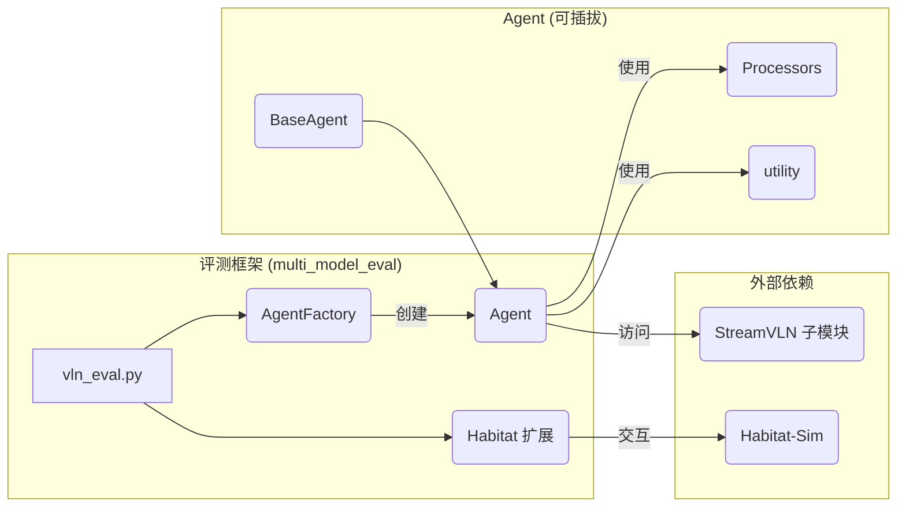
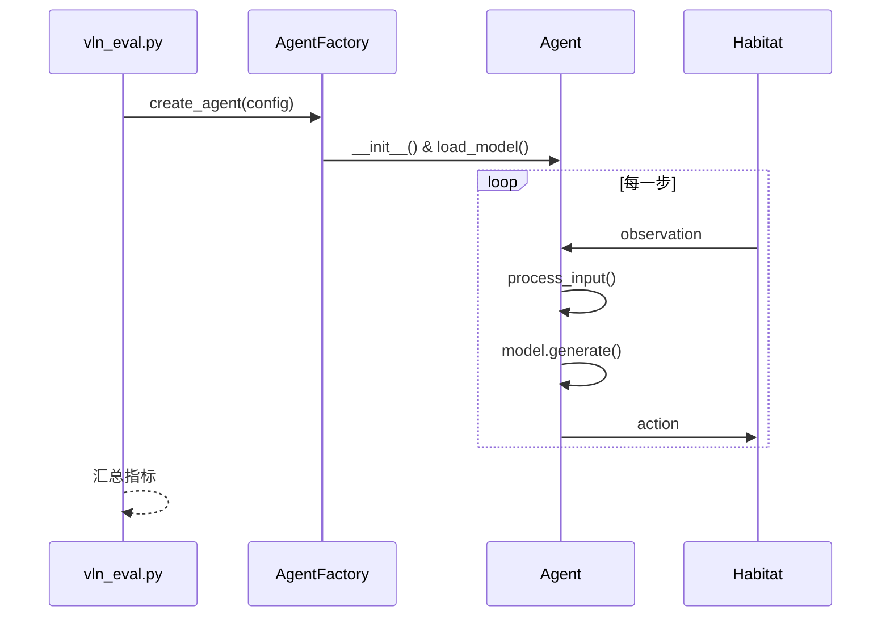
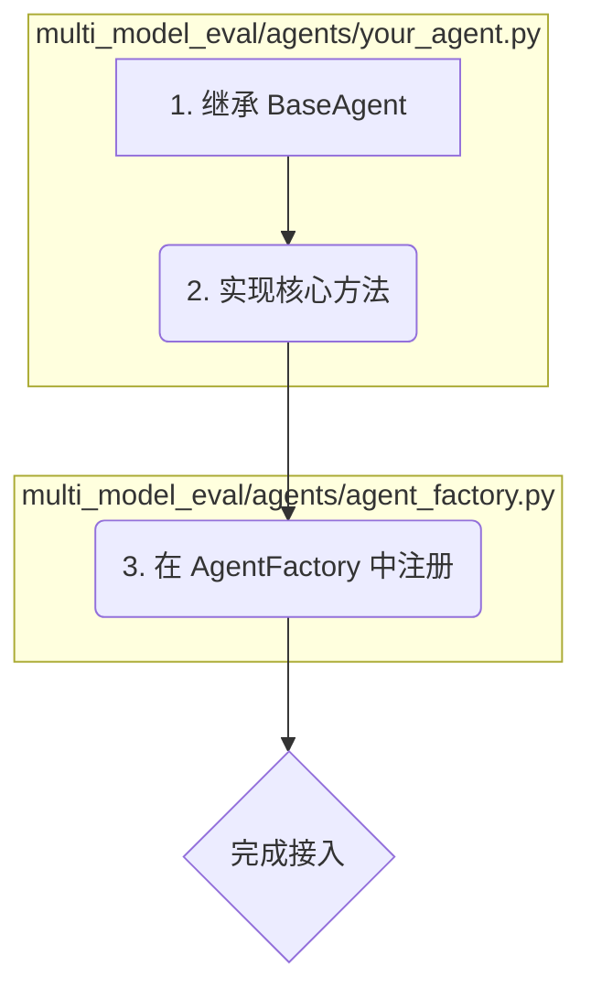

# 🎯 VLN Platform: 插件式多模型评测框架

一个面向多模型的 Vision-and-Language Navigation（VLN）评测平台，通过“Agent 插件式”设计，让您可以轻松接入新模型。

---
## 项目目录结构


- `multi_model_eval/`：本项目评测框架的核心目录。
  - `agents/`：Agent 相关代码。
    - `base_agent.py`：Agent 抽象基类，约定 `load_model_and_processor`、`act` 等核心方法。
    - `agent_factory.py`：Agent 工厂，统一创建与参数分发；新增 Agent 时需在此注册。
    - `streamvln_agent.py`：示例 Agent，实现了与 StreamVLN 的对接与适配。
    - `processors/`：输入预处理、后处理等模块，可按需扩展。
  - `utility/`：通用工具集合（设备检测、分布式工具等），避免与子模块 `utils` 命名冲突。
  - `habitat_extensions/`：与 Habitat 环境对接的扩展与适配层。
  - `vln_eval.py`：评测入口脚本（解析参数、初始化、循环评测、汇总指标）。
- `config/`：评测配置（如 R2R/RxR 数据集配置）。
- `checkpoints/`：本地模型与资源存放位置，推荐放置 Vision Tower 等（目录需包含 `config.json` 等必要文件）。
- `scripts/`：常用脚本工具（如多卡评测脚本、下载脚本等）。
- `data/`：数据集根目录（运行容器时会自动挂载）。
- `.docker/`：Docker 相关配置（Compose 文件、服务定义），用于复现环境。

- `StreamVLN/`：官方 StreamVLN 仓库，作为子模块集成。建议不要直接修改，以便后续同步上游。

👉 改动建议：
- 新增或适配模型时，优先在 `multi_model_eval/agents/` 下新增 Agent。
- 若需新增输入输出前/后处理逻辑，请在 `processors/` 目录下实现并在 Agent 中使用。
- 新增评测配置或环境参数，放在 `config/`，并通过 `--habitat_config_path` 指定。 

## 🚀 快速上手

### 本机环境工作流

一次性准备（仅首次执行）：
1. 克隆仓库（包含子模块）：
   ```bash
   git clone --recursive <your_repo_url>
   ```
2. 安装外部依赖（示例：StreamVLN）：
   ```bash
   pip install -r StreamVLN/requirements.txt
   ```
3. 准备数据与模型：
   - 将数据集放入 `data/`
   - 将视觉塔与其它模型放入 `checkpoints/`（确保包含 `config.json` 等文件）

日常评测（可重复执行）：
1. 运行评测命令   
   - 多卡脚本：
     ```bash
     bash scripts/vln_eval_multi_gpu.sh
     ```
   - 或直接运行单次评测命令：
     ```bash
     python multi_model_eval/vln_eval.py \
       --model_path <your_model> \
       --agent_type streamvln \
       --output_path results/ \
       --vision_tower_path checkpoints/google/siglip-so400m-patch14-384 \
       --habitat_config_path config/vln_r2r.yaml \
       --eval_split val_unseen
       --num_future_steps 4 \
       --num_frames 16 \
       --num_history 8 \
       --model_max_length 2048 \
       --save_video
     ```
2. 查看控制台输出与结果目录（如脚本/配置中指定的 `results/`）。

### Docker 环境工作流

前置条件：
- Docker Compose 配置位于 `.docker/` 目录
- 指定本机数据路径（用于容器挂载）：
  ```bash
  export DATA_PATH=/path/to/data
  ```

步骤：
1. 构建镜像（以 StreamVLN 评测为例）：
   ```bash
   docker compose -f .docker/docker-compose.yml -f .docker/docker-compose.streamvln.yml build
   ```
2. 启动容器（后台运行）：
   ```bash
   docker compose -f .docker/docker-compose.yml -f .docker/docker-compose.streamvln.yml up -d
   ```
3. 进入容器交互环境：
   ```bash
   docker exec -it streamvln bash
   ```
4. 在容器内运行评测：
   - 多卡脚本：
     ```bash
     bash scripts/vln_eval_multi_gpu.sh
     ```
   - 或直接运行单次评测命令：
     ```bash
     python multi_model_eval/vln_eval.py \
       --model_path <your_model> \
       --agent_type streamvln \
       --output_path results/ \
       --vision_tower_path checkpoints/google/siglip-so400m-patch14-384 \
       --habitat_config_path config/vln_r2r.yaml \
       --eval_split val_unseen
       --num_future_steps 4 \
       --num_frames 16 \
       --num_history 8 \
       --model_max_length 2048 \
       --save_video
     ```
5. 结果查看：
   - 观察容器内控制台输出
   - 根据脚本配置检查结果输出目录（通常位于项目内 `results/`）。

---

## 🛠️ 环境配置

### 本机环境

1. **克隆仓库**: `git clone --recursive <your_repo_url>`
2. **安装外部依赖**: 如StreamVLN `pip install -r StreamVLN/requirements.txt`
3. **数据与模型**:
   - `data/`: 存放评测数据集
   - `checkpoints/`: 存放本地模型 (如 Vision Tower)

### Docker 环境

docker相关文件在`.docker`目录下

1. **构建镜像**:
   ```bash
   # 以streamvln评测为例
   # 构建镜像
   docker compose -f .docker/docker-compose.yml -f .docker/docker-compose.streamvln.yml build
   ```

2. **运行容器**:
   ```bash
   # 指定本机数据路径
   export DATA_PATH=/path/to/data
    # 启动容器 (后台运行)
   docker compose -f .docker/docker-compose.yml -f .docker/docker-compose.streamvln.yml up -d
   # 进入容器
   docker exec -it streamvln bash
   ```
   > **数据挂载**: `docker-compose.yml` 已将本地 `data/` 和 `checkpoints/` 挂载到容器内，无需手动复制。

---

## 🧳 模型下载（手动/离线准备）

- 下载位置：会保存至 `./checkpoints/<组织>/<模型名>/`（包含 `config.json`、`model.safetensors` 等）
- 自定义：可编辑 `scripts/download_models.py` 末尾 `models_to_download` 列表

#### 批量下载推荐模型
```bash
# 需联网环境，建议先安装工具包
pip install huggingface_hub requests

# 执行下载（默认会下载若干常用模型）
python scripts/download_models.py
```

#### 仅下载单个模型（示例：SigLIP）
```bash
python - << 'PY'
from scripts.download_models import download_single_model
# HF 仓库名示例：google/siglip-so400m-patch14-384
ok = download_single_model('google/siglip-so400m-patch14-384', 'SigLIP vision model')
print('done:', ok)
PY
```

下载完成后：
- 在本机运行：直接使用 `--vision_tower_path checkpoints/google/siglip-so400m-patch14-384`
- 在容器中运行：确认 `checkpoints/` 已通过 Compose 挂载到容器内

---

## ⚙️ 运行评测

在**容器内**或**已配置的本机环境**中执行：
```bash
bash scripts/vln_eval_multi_gpu.sh
```

---

## 🧩 框架设计

### 核心理念：关注点分离
- **评测管线 (本框架)**: 负责环境交互、指标计算、分布式支持。
- **Agent (用户实现)**: 封装模型加载、数据处理、动作生成。

### 架构图


### 评测时序


---

## 🔌 如何接入你的 Agent

仅需 3 步，即可将您的模型接入评测管线。

### 流程图


### 1. 继承 `BaseAgent`
创建 `multi_model_eval/agents/your_agent.py` 文件：
```python
from .base_agent import BaseAgent

class YourAgent(BaseAgent):
    # ... 实现后续方法
```

### 2. 实现核心方法
- `load_model_and_processor()`: 加载模型和处理器。
- `act()`: 根据观测生成动作。

#### 示例代码
```python
# multi_model_eval/agents/your_agent.py
class YourAgent(BaseAgent):
    def load_model_and_processor(self, model_path, **kwargs):
        # 加载您的模型、Tokenizer、Processor
        config = YourConfig.from_pretrained(model_path)
        tokenizer = YourTokenizer.from_pretrained(model_path)
        model = YourModel.from_pretrained(model_path, config=config)
        processor = YourProcessor(tokenizer=tokenizer)
        
        return model, processor

    def act(self, env_id, step_id, obs):
        # 1. 预处理观测数据
        model_inputs = self.processor.prepare_from_inputs(obs)
        
        # 2. 模型推理
        outputs = self.model.generate(**model_inputs)
        
        # 3. 后处理并返回动作
        text = self.processor.decode(outputs)
        actions = self.parse_actions(text)
        return actions[0]
```

### 3. 在 `AgentFactory` 中注册
```python
# multi_model_eval/agents/agent_factory.py

class AgentType(Enum):
    STREAMVLN = "streamvln"
    YOUR_AGENT = "your_agent"  # 1. 添加枚举

class AgentFactory:
    def create_agent(self, config):
        agent_type = config.agent_type
        
        if agent_type == AgentType.YOUR_AGENT:
            # 2. 添加创建逻辑
            from .your_agent import YourAgent
            return YourAgent(**config.agent_params)
        
        # ... 其他 Agent
```

---

## 💡 FAQ

- **本地视觉塔**: 使用 `--vision_tower_path` 参数指向本地目录。
- **命名冲突**: 框架内工具模块已重命名为 `utility`，避免与子模块 `utils` 冲突。
- **注意力机制**: 框架自动检测并选择最佳实现 (FlashAttention > SDPA > eager)。

---

## 轨迹碰撞纠正（RxR/R2R 兼容）

该脚本用于在评测完成后，针对包含碰撞的轨迹进行闭环纠正。它将沿用已收集的动作序列，在首次碰撞发生前回放，然后使用 `ShortestPathFollower` 进行追踪式纠偏，输出新的动作序列与可选的可视化。

- 要求输入
  - 来自评测脚本生成的可视化目录，例如：`results/RxR/val_unseen/streamvln/vis_0` 下的各个 episode 子目录（每个目录含 `actions.json` 和 `frames/`）
  - `actions.json` 支持两种格式：
    - 纯整数动作索引数组：`[0,1,1,2,...]`
    - 对象数组（含 `action_idx` 字段）：`[{action_idx: 1, ...}, ...]`
  - `collision_flags` 为发生碰撞的步编号（与保存帧编号对齐）。脚本会取最早的碰撞步作为截断点。

- 输出内容
  - `actions_corrected.json`：包含回放至截断点后由最短路跟随器生成的纠正动作序列，自动回填缺失的 `instruction`。
  - `frames_corrected/`：纠正过程中的 RGB 帧。
  - 可选 `correction_debug.mp4`（加 `--save-video`）。

- RxR 兼容
  - 当使用 RxR 配置（如 `config/vln_rxr.yaml`）时，脚本会自动启用 RxR-aware 配置加载器（`multi_model_eval/habitat_extensions`）。
  - 若 `actions.json` 中没有 `instruction` 字段，会从 episode 中提取（兼容 RxR 的 `instruction.instruction_text` 与 R2R 字符串形式）。

- 使用示例
```bash
python scripts/correct_collisions.py \
  --habitat-config-path config/vln_rxr.yaml \
  --split val_unseen \
  --input-dir results/RxR/val_unseen/streamvln/vis_0 \
  --actions-file actions.json \
  --output-name actions_corrected.json \
  --goal-radius 1.0 \
  --save-video
```

- 注意事项
  - `--split` 必须与生成结果的 split 匹配（例如 `val_unseen`）。
  - `--input-dir` 指向包含若干 `{sceneId}_{episodeId}` 子目录的一层（如 `vis_0`）。
  - 如需使用人类动作文件，改用 `--actions-file actions_human.json` 即可（脚本会自动兼容两种动作格式）。
  - 若处理 R2R，请将 `--habitat-config-path` 改为 `config/vln_r2r.yaml`，并切换到对应的 `results` 路径。

- 相关公共函数
  - 公共工具位于 `multi_model_eval/utility/vln_common.py`：`save_rgb`、`create_visualization_frame`、`is_rxr_config`、`get_episode_instruction`，被 `multi_model_eval/vln_eval.py` 与 `scripts/correct_collisions.py` 共同复用。

## 📚 参考
- StreamVLN 官方仓库 (子模块): [`InternRobotics/StreamVLN`](https://github.com/InternRobotics/StreamVLN.git) 